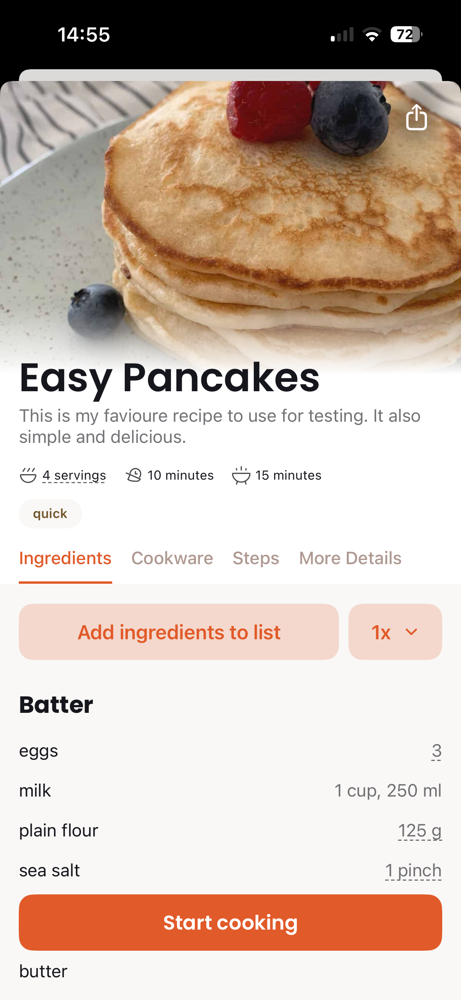
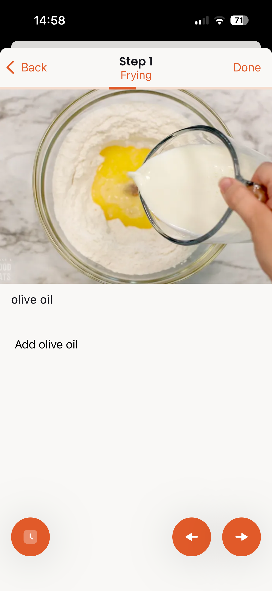
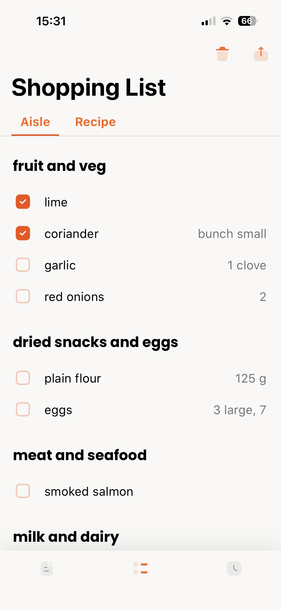
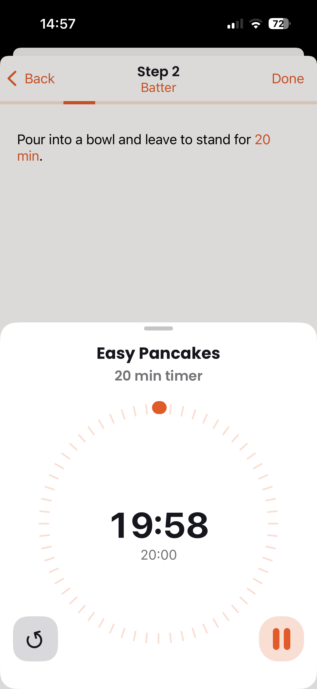

# Cook: Recipe Manager for iPhone and iPad

Your complete recipe companion. Browse your [Cooklang](https://cooklang.org) recipe collection, cook with step-by-step guidance, and create smart shopping lists — all from your pocket.

  

  
  
  
  

## Features

- **Browse & search** your recipe collection organized by folders
- **Rich metadata** — servings, prep/cook time, difficulty, cuisine, tags, and more
- **Recipe scaling** — adjust by multiplier, servings, or a specific ingredient amount
- **Cooking mode** — step-by-step instructions with large text, swipe navigation, and mise en place checklist
- **Built-in timers** — tap a time in any step to start a timer; run multiple timers at once with lock screen notifications
- **Smart shopping lists** — auto-generated from recipes, organized by store aisle, shareable with family
- **Clip recipes** — import from any website URL or snap a photo of a cookbook page
- **Share recipes** — generate a QR code or shareable link for any recipe
- **Sync options** — CookCloud (cross-platform), iCloud Drive, or local folders
- **Offline support** — recipes are available without an internet connection once synced
- **Own your data** — plain text Cooklang files, no account required

## Getting Started

1. Download **Cook** from the [App Store](https://apps.apple.com/app/cook-recipe-manager/id1438249838)
2. Choose a sync method: **CookCloud** (recommended), **iCloud Drive**, or **Local Folder**
3. Add `.cook` recipe files to your synced folder — learn the simple Cooklang syntax at [cooklang.org](https://cooklang.org)

Requires iOS 15.0 or later.

## Help & Documentation

Full documentation with screenshots is available at [cook.md/help](https://cook.md/help):

- [Overview](https://cook.md/help/ios) — what the app can do
- [Getting Started](https://cook.md/help/ios/getting-started) — setup and first sync
- [Using the App](https://cook.md/help/ios/using-the-app) — features guide
- [Troubleshooting](https://cook.md/help/ios/troubleshooting) — common issues and FAQ

What changed in each version is in the [changelog](CHANGELOG.md), also published as [releases](https://github.com/cook-md/ios-app/releases) you can watch or follow by RSS.

## Feedback

This repository is for collecting feedback about the Cook iOS app:

- **Bug reports** — [open an issue](../../issues)
- **Feature requests & questions** — [start a discussion](../../discussions)

## Related

- [Cooklang](https://cooklang.org) — the recipe markup language
- [CookCLI](https://github.com/cooklang/CookCLI) — command-line tool for Cooklang
- [Cook for Android](https://github.com/cook-md/android-app) — Android version
- [Sync Agent](https://github.com/cook-md/sync-agent) — CookCloud sync for desktop
